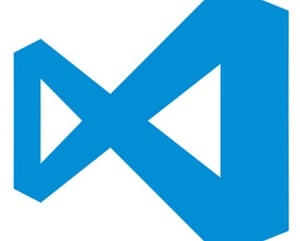

# A hackers guide to the Atom editor

## Codemotion Tel Aviv

## @chrischinch

## Let's do the presentation in Atom! 🤞 🤔 🙄

* * *

Atom is the hackable text editor from GitHub, it was also the first application to use the Electron framework for creating native applications in JavaScript. It's cross-platform, and I love it 😍 😈.


Yes, once you're inside Atom it's pretty much all JavaScript, which makes it very easy to customise, and as Atom is open source you're free to go crazy, in fact Nuclide from Facebook and Visual Studio Code from Microsoft are both based on Atom.




At the moment it's actually a mix of JavaScript and Coffeescript, but that's changing.

There are loads of packages that extend functionality, some of my favourites are:

-   Linter and it's extensions
-   Git Time machine
-   Pandoc previewer
-   Pull requests

**Show them Chris!**

* * *

There are also loads of themes, for the UI and syntax, I personally use Unity and One O Eight.

In the GUI you can change a lot of settings, and trigger commands, but the real power lurks beneath the surface, and anything you can do with the GUI, you can also do with config files and keyboard shortcuts.

**Chris, shut up already and show me some code then!**

* * *

The config file, found in _.atom/config.cson_ (there's that CoffeeScript). Contains everything from the core and package preferences in a text file, including settings that you can't find visually, or are harder to find, like grammars and languages. Packages often don't clean up after themselves and you will find a lot of settings here that you no longer need.

Most of the time when you make a change it should be reflected immediately, but I have found that recently this doesn't happen so much, open up the command pallette and reload the window to refresh.

**Reload the Windows?**

Yup, this is all running in a Chromium instance, go to _View -> Developer_ and you will find some familiar tools, more on them later.

* * *

Next is the _init.coffee_ file (this file can also be named `init.js` and contain JavaScript code.), giving you a chance to run CoffeeScript code to make small customizations. Code in this file has full access to [Atom's API](https://atom.io/docs/api/latest).

Because `init.coffee` provides access to Atom's API, you can use it to implement useful commands without creating a new package or extending an existing one. Here's a command which uses the [Selection API](https://atom.io/docs/api/latest/Selection) and [Clipboard API](https://atom.io/docs/api/latest/Clipboard) to construct a Markdown link from the selected text and the clipboard contents as the URL:

```coffee
atom.commands.add 'atom-text-editor', 'markdown:paste-as-link', ->
  return unless editor = atom.workspace.getActiveTextEditor()

  selection = editor.getLastSelection()
  clipboardText = atom.clipboard.read()

  selection.insertText("[#{selection.getText()}](#{clipboardText})")
```

Now, reload Atom and use the [Command Palette](/getting-started/sections/atom-basics/#command-palette) to execute the new command, "Markdown: Paste As Link", by name. And if you'd like to trigger the command via a keyboard shortcut, you can define a [keybinding for the command](/using-atom/sections/basic-customization/#customizing-keybindings).

* * *

Next is _keymap.cson_ that defines commands bound to keyboard shortcuts, packages don't add them here, but you can override them.

```coffee
'atom-text-editor':
  'ctrl-left': 'editor:move-to-beginning-of-word'
```

Or:

```coffee
"atom-text-editor[data-grammar='source example']":
```

The format is:

```coffee
'class-in-focus':
  key-combination': 'package:command'
```

You can also use standard selectors to target elements (in the underlying CSS, again more on that soon):

```coffee
atom-text-editor:not([mini])':
```

As is the case with CSS applying styles, when multiple bindings match for a single element, the conflict is resolved by choosing the most _specific_ selector. If two matching selectors have the same specificity, the binding for the selector appearing later in the cascade takes precedence.

You can also unset shortcuts if they are causing your problems:

```coffee
'.tree-view':
  'a': 'unset!'
```

* * *

Snippets in _snippets.cson_

Snippets are a powerful way to quickly generate commonly needed code syntax from a shortcut. In the format of grammar, name, trigger phrase and full snippet:

```coffee
'.source.gfm':
  'Git repo intro':
    'prefix': 'Git Repo Intro'
    'body': '[https://www.contentful.com](Contentful) is a content management platform for web applications, mobile apps and connected devices. It allows you to create, edit & manage content in the cloud and publish it anywhere via powerful API. Contentful offers tools for managing editorial teams and enabling cooperation between organizations.'
```

You can also use [CoffeeScript multi-line syntax](http://coffeescript.org/#strings) using `"""` for larger templates:

```coffee
'.source.js':
  'if, else if, else':
    'prefix': 'ieie'
    'body': """
      if (${1:true}) {
        $2
      } else if (${3:false}) {
        $4
      } else {
        $5
      }
    """
```

* * *

Finally, in _styles.less_ you can override styles. Time to open that web inspector!

```less
.tree-view .list-tree {
    position: static;
    font-size: 1.2em;
}
```

_I even made a customisation for this presentation_.

**Great Chris, but I want to share with others, show me how!**

## Creating themes

You can create a syntax or UI theme, and helpfully Atom has helpers to get you started. It even creates an alias from the project location to your _.atom_ folder and generates boilerplate styles for you. When you set the theme as your new one, changes you make are still applied.

You can avoid reloading to see changes you make by opening an Atom window in Dev Mode. To open a Dev Mode Atom window run `atom --dev .` in the terminal, or use the _View > Developer > Open in Dev Mode_ menu. When you edit your theme, changes will instantly be reflected!

* * *

A UI theme isn't quite so seamless, I'll show you with one I made earlier.

1.  Fork the [ui-theme-template](https://github.com/atom-community/ui-theme-template)
2.  Clone the forked repository to the local filesystem
3.  Open a terminal in the forked theme's directory
4.  Open your new theme in a Dev Mode Atom window run `atom --dev .` in the terminal or use the _View > Developer > Open in Dev Mode_ menu
5.  Change the name of the theme in the theme's `package.json` file
6.  Name your theme end with a `-ui`, for example `super-white-ui`
7.  Run `apm link --dev` to symlink your repository to `~/.atom/dev/packages`
8.  Reload Atom using <kbd class="platform-mac">Alt+Cmd+Ctrl+L</kbd><kbd class="platform-windows platform-linux">Alt+Ctrl+R</kbd>
9.  Enable the theme via the "UI Theme" drop-down in the "Themes" tab of the Settings View
10. Make changes! Since you opened the theme in a Dev Mode window, changes will be instantly reflected in the editor without having to reload.

* * *

## Creating packages

Packages are a more complex affair, depending what you want to accomplish, so this wont be a comprehensive guide, more of an introduction what's possible and specific to Atom and then you can fill in the gaps with your JavaScript knowledge.

Again there's a boilerplate generator that creates an alias. Now by default, the package generator emits JavaScript. You can change in the Settings View, go to the package-generator settings and change the "Package Syntax" setting to "CoffeeScript".

First there's the standard JavaScript project files, Readme, package.json (Some other keys are available) etc. Then a couple of custom folders:

-   _keymaps_: Where you define keyboard shortcuts bound to your functions.
-   _lib_: Visual and logical code.
-   _menus_: Similar to keybindings, but for creating menu items, contextual and the Packages menu.
-   _specs_: Test for your code, written in Jasmine.
-   _styles_: Styles for your custom components or if you want to override a style.

Your package's top-level module is a singleton object that manages the lifecycle of your extensions to Atom. Even if your package creates ten different views and appends them to different parts of the DOM, it's all managed from your top-level object.

Your package's top-level module can implement the following basic methods:

-   `activate(state)`: This **optional** method is called when your package is activated. It is passed the state data from the last time the window was serialized if your module implements the `serialize()` method. Use this to do initialization work when your package is started (like setting up DOM elements or binding events).
-   `initialize(state)`: (Available in Atom 1.14 and above) This **optional** method is similar to `activate()` but is called earlier. Whereas activation occurs after the workspace has been deserialized (and can therefore happen after [your package's deserializers](http://flight-manual.atom.io/behind-atom/sections/serialization-in-atom/#serialization-methods) have been called), `initialize()` is guaranteed to be called before everything. Use `activate()` if you want to be sure that the workspace is ready; use `initialize()` if you need to do some setup prior to your deserializers or view providers being invoked.
-   `serialize()`: This **optional** method is called when the window is shutting down, allowing you to return JSON to represent the state of your component. When the window is later restored, the data you returned is passed to your module's `activate` method so you can restore your view to where the user left
    off.
-   `deactivate()`: This **optional** method is called when the window is shutting down. If your package is watching any files or holding external resources in any other way, release them here. If you're just subscribing to things on window, you don't need to worry because that's getting torn down anyway.

* * *

### Publishing

Atom bundles a command line utility called `apm` to search for and install packages via the command line. The `apm` command can also be used to publish Atom packages to the public registry and update them.

#### Prepare Your Package

There are a few things you should double check before publishing:

-   Your `package.json` file has `name`, `description`, and `repository` fields.
-   Your `package.json` file has a `version` field with a value of `"0.0.0"`.
-   Your `package.json` file has an `engines` field that contains an entry for Atom such as: `"engines": {"atom": ">=1.0.0 <2.0.0"}`.
-   Your package has a `README.md` file at the root.
-   Your `repository` URL in the `package.json` file is the same as the URL of your repository.
-   Your package is in a Git repository that has been pushed to [GitHub](https://github.com). Follow [this guide](http://guides.github.com/overviews/desktop) if your package isn't already on GitHub.

#### Publish Your Package

Before you publish a package it is a good idea to check ahead of time if a package with the same name has already been published to [the atom.io package registry](https://atom.io/packages).

Now let's review what the `apm publish` command does:

1.  Registers the package name on atom.io if it is being published for the first time.
2.  Updates the `version` field in the `package.json` file and commits it.
3.  Creates a new [Git tag](http://git-scm.com/book/en/Git-Basics-Tagging) for the version being published.
4.  Pushes the tag and current branch up to GitHub.
5.  Updates atom.io with the new version being published.

You use the same command to update a package.

* * *

## API

So what is possible within Atom, here's a few API examples and methods:

### Config

For creating, reading settings and preference panes. (show Medium export)

### Getting text

For getting text editor content, or specific selected content. (show Medium export)

### Change the UI

For getting or changing the cirrent properties of the Editor. (show Medium export -> Workspace)

### Clipboard

Copy / Paste, what you'd expect.

### Directory / File

Directory and file access. reading, writing, watching.

### Notifications (not system)

Tell the user things they need to know. (show Medium export)

And so much more… 🚀 🚀 🚀

* * *

# Thank you!


## gregariousmammal.com

## @chrischinch

### Read the Atom Flight Manual!
