# The Past, Present and Future of Swift
_Voxxed Belgrade_<br/>
@chrischinch

---

## My Story

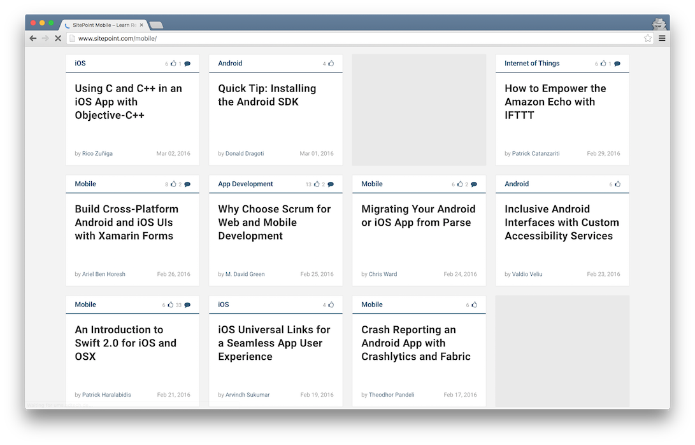

Note: I stopped doing this. Not too technical a talk. Mobile editor, love the enthusiam, I am a writer blah blah. I like living on the edge, bring on live demos! VM, issues, hopefully wont hold us up.

---

## Looking Back
First a History Lesson

---

## Objective-C

---

## 1980s and NeXT

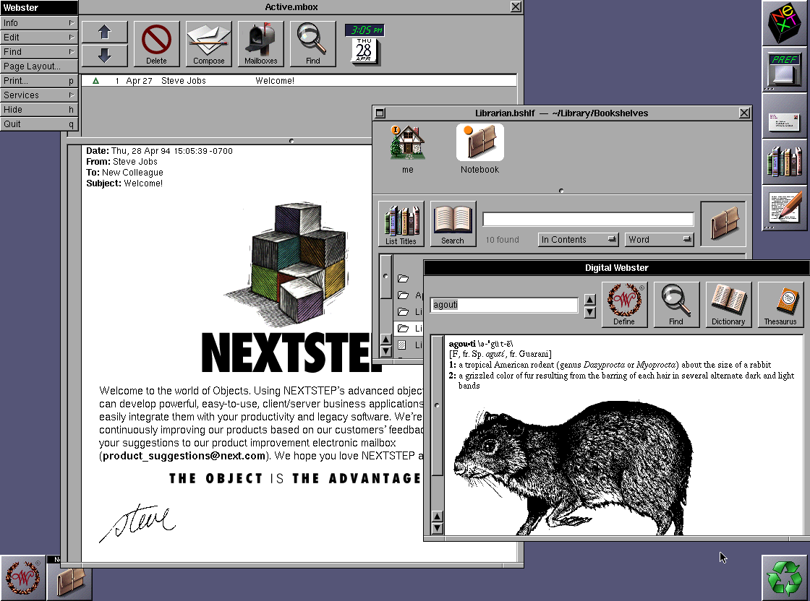

Note: Objective-C is a general-purpose, object-oriented programming language that adds Smalltalk-style messaging to the C programming language. APIs Cocoa and Cocoa Touch.

Originally developed in the early 1980s. It was selected as the main language used by NeXT for its NeXTSTEP operating system, from which OS X and iOS are derived.

---

## It's Heritage is Everywhere


Note: App Kit and Foundation Kit to name a few. Anyone remember this? I do :) It's Apple part x and re-introduces Steve Jobs. Basically it's heritage is everywhere.

---

## Score Card

- &#43; Thin Runtime
- &#43; Leverage GCC and Libraries
- &#43; Low barrier to entry (At the time)
- &#45; Larger than C / C++
- &#45; Namespace support
- &#45; Optimisation
- &#45; High barrier to entry (Now)
- &#45; Closed Source

Note: Because Objective-C uses dynamic runtime typing and because all method calls are function calls (or, in some cases, syscalls), many common performance optimizations cannot be applied to Objective-C methods (for example: inlining, constant propagation, interprocedural optimizations, and scalar replacement of aggregates). This limits the performance of Objective-C abstractions relative to similar abstractions in languages such as C++ where such optimizations are possible.

---

## Enter Swift

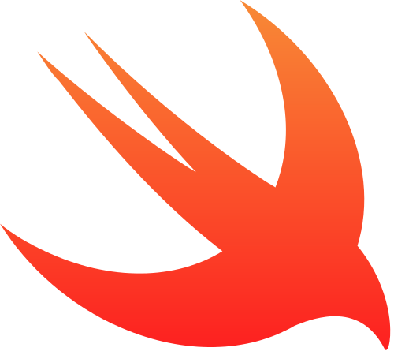

Note: I'm not going to cover why, what etc… I htink you know that already and if you don't check the Wikipedia page…

---

## Not Everyone is a Fan

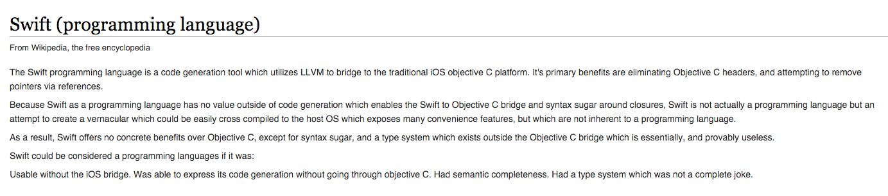

---

## 2.2+ Apache License 2.0 on December 3, 2015

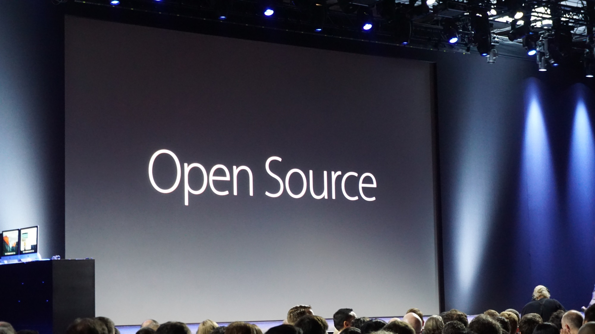

Note: As far as I can tell, Apple's first github repo

---

## Enthusiasm

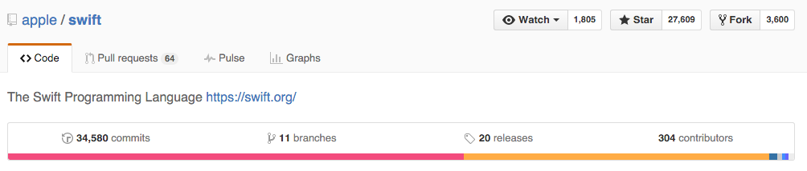

Note: Since DECEMBER. This is why I like Swift, I am more of a community person. The enthusiasm is what attracts me. Of course being from Apple helps and maybe in the future theres is now choice, but still.

---

## The Present

---

## Swift vs Apple


Note: A point of confusion is Swift vs iOS and OS X. These are platforms that consist of proprietary libraries that will likely NEVER be OS and are not available as part of Swift. Apple So far have been very supportive and communicative.

---

## What's in the Box?

- Compiler
- Standard Library
- SDK Overlays
- Debugger

Note: SDK overlays relate to the above.

---

## Linux

```bash
wget https://swift.org/builds/swift-2.2-branch/ubuntu1404/xxx.tar.gz
tar -xvf xxx.tar.gz
sudo apt-get install clang
export PATH=/home/vagrant/xxx/usr/bin:"${PATH}"
```

Note: Swift on Linux does not depend on the Objective-C runtime nor includes it
Clang - Compiler front end.
Switch to Vagrant box, ssh in.
run swift --version.

---

## Write, Compile & Run

```bash
swiftc helloworld.swift
ls -al
./helloworld
```

Note: Wow, amazing…

---

## Server-side Swift with Perfect

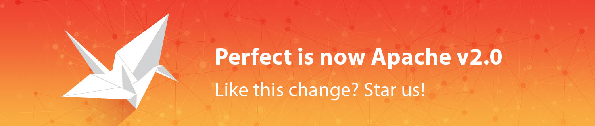

Note: This takes Swift into similar territory to Node.js / JS, but compiled, statically typed etc.

---

## A Perfect Example

```bash
git clone https://github.com/PerfectlySoft/Perfect.git //On Mac
```

_Perfect/Examples/Examples.xcworkspace_

Note: Open Tap tracker, start server component (Run bar) and then App, make some taps (Debug), show in Xcode Console. But what about linux?!

---

## A Linux Swift Server

Build PerfectLib

```bash
sudo apt-get install libssl-dev libevent-dev libsqlite3-dev libicu-dev libcurl4-openssl-dev uuid-dev git
git clone https://github.com/PerfectlySoft/Perfect.git

cd Perfect/PerfectLib
make
sudo make install
```

---

## A Linux Swift Server

Build Perfect Server

```bash
cd ../PerfectServer
make
```

---

## A Linux Swift Server

Create shared object, copy to server directory and run!

```bash
cd ../Examples/Tap\ Tracker/
make
cp TapTracker.mustache ../../PerfectServer/webroot/TapTracker.mustache
cp index.html ../../PerfectServer/webroot/index.html

cd ../../PerfectServer
mkdir PerfectLibraries
cp ../Examples/Tap\ Tracker/TapTrackerServer.so ./PerfectLibraries

./perfectserverhttp
```

---

## A Linux Swift Server

Change and run App

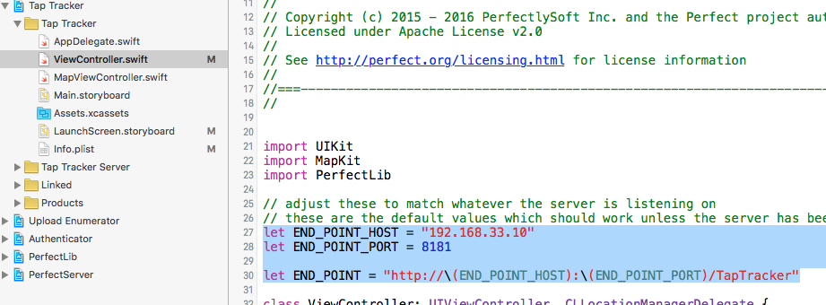

Note: Show Console and Vagrant console

---

## A Linux Swift Server

Taking it Further...

- FastCGI connectivity for Apache 2.4.
- Connectivity for MySQL databases.
- Connectivity for PostgreSQL databases.
- Connectivity for MongoDB databases.

---

## Of Course there's a Framework!

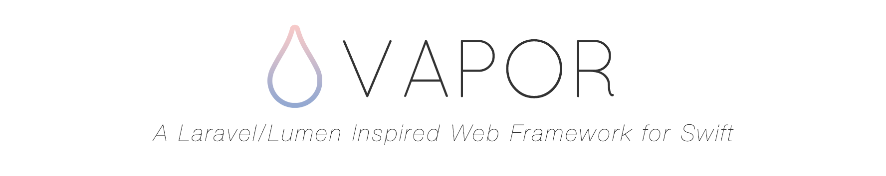

github.com/qutheory/vapor

Note: Linux (note version on Mac, 2.1) (./run), need DEV release. Think Rails / Laravel, MVC, routing etc. Docker, deployment, Upstart, NGinx etc. Switch to Mac copy to show files. JSON output… Apps!

---

## Tools, tools, tools

- **swiftenv**: Swift Manager
- **swifter**: HTTP Server
- **NSLinux**: Linux Compatibility

Note: Just some…

---

## The Future

## 'Windows' and 'Android'

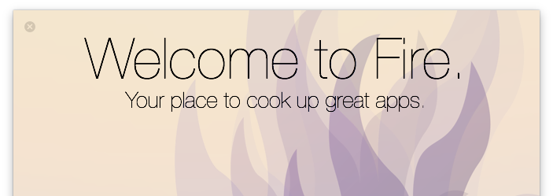

Mac = Fire<br/>
Windows = Silver

Note: Tools like this, and early days. Yes, meh. not the future I know…

---

## 'Native' Android

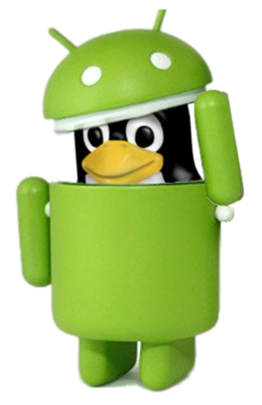

romain.goyet.com/articles/running_swift_code_on_android/

Note: Using NDK, which is not recommended, kind of like using C, C++ and Go with Android, it's possible but is it really worth it right now?

---

## 'Native' Android

```bash
swiftc -emit-object helloworld.swift
nm hello_swift.o
```

_hello.o_ object file is C++ like

Note: Swift mangles symbols kind of like C++. Indeed, the print function wasn't resolved to a _print symbol but to a much more convoluted __TFSs5printFTGSaP__9separatorSS10terminatorSS_T_ list of symbols. There's also a bunch of other symbols required too, that seem to deal with string conversion and memory handling.

---

## 'Native' Android

```bash
ld -arch x86_64 -o hello helloworld.o -L /Library/Developer/CommandLineTools/usr/lib/swift/macosx -lSystem -lswiftCore

swiftc -parse-as-library -target armv7-apple-ios9.0 -emit-ir helloworld.swift > helloworld.ll
```

Note: LOCAL - CHANGE COMMENTS All those symbols are defined in libswiftCore.dylib, which is somewhere in the $SDK. Let's give that info to the linker
No SwiftCore Library, super limited
Generate LLVM Intermediate Representation from the Swift code
Translate that IR to some x86_64 machine code, packaged as a Mach-O file
We have to add a "grep" filter to remove some iOS-specific metadata added by the Swift compiler. Not in this example

---

## 'Native' Android


Note: No longer worked :(

---

## The Plan...

1. Generate an object file from the LLVM-IR
2. Package that object file in an Android app (Likely C)
3. Pack in a Shared Library and run

Note: No longer worked :(
Generate an object file from the LLVM-IR
From this point on we'll need the Android NDK. Luckily it ships with an LLVM toolchain, whose llc (LLVM static compiler) we can leverage.

---

## 'Native' Windows

For the Bold...<br/>
sweettutos.com/2012/08/11/objective-c-on-windows-yes-you-can/

---

## Swift 3

- Core Libraries*
- Goodby `NS`
- ABI Improvements
- Resilience & Portability
- Consistency, Consolidation

Stay up to Date - swift.org/community

Note: Core Libraries - Higher level abstraction to standard library
ABI - Application Binary Interface, Interface between Libraries and OS
R&P all about cross platform stability
In short, more cross platform

---

## Swift X

- Test Modules
- C++ Interoperability*
- Language Concurrency
- Full Source Compatibility

Stay up to Date - swift.org/community

Note: As opposed to platform concurrency

---

## Why Swift?

- Interested Backer
- Developer Friendly
- Responsive
- Cross Platform*
- Enthusiastic Community

Note: Responsive team

---

## Thank You!

Chris Ward

@chrischinch | gregariousmammal.com


Note: Like what I do, buy merch, see my support page, buy merch and I have stickers. I work at Contentful and blog.
