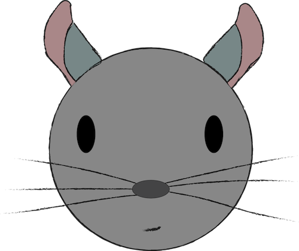

<!-- .slide: data-background-color="#192532" -->

# What IKEA and game manuals taught me about technical writing
_Write the Docs 2016_

@chrischinch

Note: Paul and I are competing for titles. This is a short talk, simplified from my original description as I only have 15mins, more to come… Be curious. Have fun.

---

## What now?

Note: A talk I want to take to more general events (and am). We have heard already today from writers in other fields, in this talk I'm going to go even broader, but with people who I think are still 'tecnical writers'.

---

<!-- .slide: data-background="./chipshop.jpg" -->

Note: Explain what Chip Shop is, the process, why etc. Explain where I come from, and how it all relates. Looking at how game manuals were written helped me understand my own tech writing better. I want to talk to some designers of instructional manuals but haven't yet, I have spoken to games writers though. What is technical writing? Explaining a set of steps, instructions, guidance.

---

## …Oh, and I moved cities

---

<!-- .slide: data-background="./instructions_IKEA_billy.jpg" -->

Note: So of course, I spent a lot of time looking at these. Personally I think they are surprisingly good. More on that later. This all made me think that there are many writers making technical explanations understandable and clear. We are all technical writers! Again steps and guidance.

---

## Who

---

> You can take this action

Note: An extracted example, from an older game, when manuals were worse. What does 'you' mean? You, your ally? Some of this is due to English, in German this would be clearer.

---

<!-- .slide: data-background="./cosmicencounter_03.jpg" -->

Note: This is from Cosmic Encounter, a similar but revised game, with some similar mechanics, notice how they make the abilities clearer, but still loads of text.

---

## Lessons learned

Who are you writing for?

Less can be more

Consider the context of the reader

---

## What?

---

<!-- .slide: data-background="./ikea_clarity.png" -->

Note: I think these are great. Everything is included, you don't need to know what they're called. And you can even measure in the manual.

---

<!-- .slide: data-background="./eh01_rulebook-5.png" -->

Note: Games can be complex, EH is, this diagram helps somewhat in understanding what setup is needed.

---

## Lessons learned

Link to external concepts

Add interactivity

Images, videos

Note: Interactive consoles have helped a LOT for me, I don't like videos but newer coders love them etc.

---

## Testing

---

<!-- .slide: data-background="./play_test.jpg" -->

Note: As technical writers we have amazing tools for testing our writing, but our audience is still humans, and they have a tendency to do things we don't expect, or try to 'break' what you've built. I'm not a maths thinker, and in early tests of my game, I found that gamers like to find ways to break your game. In ost cases your testign is face-to-face, which is brutal.

---

<!-- .slide: data-background="./ikea_whoops.jpg" -->

Note: Some products need steps to be executed in a certain order, or they wont work out right.

---

## Lessons learned

Test with people

If order is essential, guide users

Note: We spend a lot of time thinking about onboarding and getting people to follow our steps in teh right order. But of course due to search and over zealous developers, this may not always be the case. How do we encourage developers to follow the 'right' steps without forcing them into things and annoying them?

---

## Inclusive

---

<!-- .slide: data-background="./7wonders_icons.png" -->

Note: This is an extreme example, but I like the idea of recognisable icons instead of lots of text. This is hard to get right, especially if you have unique concepts, but if you get it right it can also help reducing the need for translations, and helps with consistency. On a game board it helps identify actions instead of having to be able to read text.

---

<!-- .slide: data-background="./accessible.png" -->

Note: Whilst some criticise IKEA manuals, to me someone has spent a lot of time trying to make these clear in most languages and cultures. No words, nothing culturally exclusive. Nothing to translate, this is one copy for all markets. This can also be done with words, don't patronise the reader 'simply', it's obvious etc.

---

## Lessons learned

Consistent, bite sized concepts

Don't alienate the reader

---

## Story Telling

---

<!-- .slide: data-background="./grizzled.png" -->

Note: This game is about war in WW1 trenches, but still, it handles it in a balanced and as fun as possible kind of way. Players are about to go through an intense experience, bring them into the atmosphere. At our Berlin meetup we had an RPG games writer, there it's more about story over mechanics, with board games mechanics over story.

---

<!-- .slide: data-background="./ikea_fun.png" -->

Note: You may recognise this gender non-specific character too. Ikea knows that people struggle with their manuals and these are physical products. They're not afraid to acknowledge, and even have some fun with it.

---

## Lessons learned

Consistent examples and use cases

Have 'balanced' fun

Note: It's a balancing act, many use the Mail Chimp docs as example of fun, sometimes I find that actually a bit patronising and it's a fine line to walk. If it's too silly people may not take it seriously, startups vs enterprise.

---

## Community

---

<!-- .slide: data-background="./10-ikea-hacks-for-the-kitchen2.jpg" -->

Note: The internet is full of stuff like this, and I'm not saying that Ikea pays any attention, but they don't tell people to stop. Kind of reminds you of open source?

---

<!-- .slide: data-background="./bgg_feedback.png" -->

Note: Same in the gaming world, bgg is full of forums over user submitted content, errata, translations etc… Rarely taken down, and often used / incorporated

---

## Lessons learned

Allow and accept feedback

Look at feedback

Helps with testing

Note: Ecosystems can help you fill in gaps in your own product you didn't even know you had.

---

## Thank You!

Chris Ward

@chrischinch | gregariousmammal.com

Note: Like what I do, buy merch, see my support page, buy merch and I have stickers. I work at Contentful and blog.
